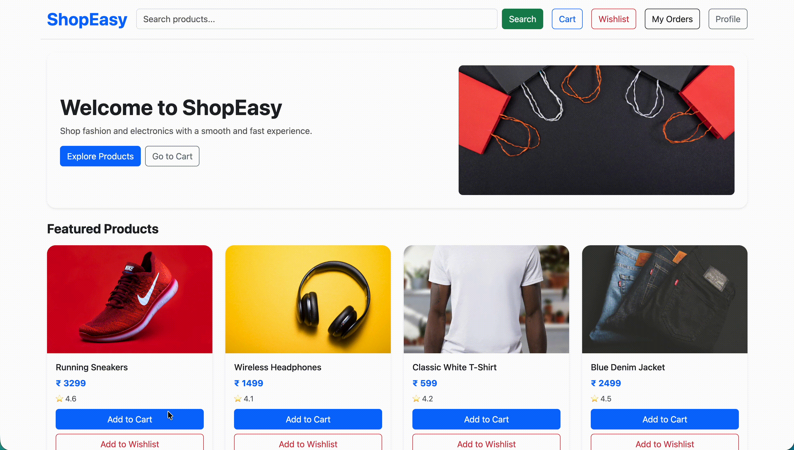

# ShopEasy

A full-stack e-commerce web app where users can browse products, search and filter them, view product details, and manage a cart and wishlist. Fashion and electronics with a smooth, fast experience.

Built with a **React (Vite)** frontend, an **Express/Node** backend, a **MongoDB (Mongoose)** database, and **localStorage** to persist the cart and wishlist across refreshes.



---

## Demo Link

[Live Demo](https://major-project-a32c.vercel.app/) &nbsp;•&nbsp; [Backend API](https://m-ecommerce-backend.vercel.app/)

> No login required — just open the live demo and start shopping.

---

## Demo Video

Watch a walkthrough (~6 minutes) of all major features: [YouTube Demo](https://youtu.be/TGheiwFFn7M)

---

## Quick Start

This project has two separate repos: a frontend and a backend.

**Backend**

```bash
git clone https://github.com/rahulsoni070/M-ecommerce-backend.git
cd M-ecommerce-backend
npm install
npm run dev
```

**Frontend**

```bash
git clone https://github.com/rahulsoni070/Major-Project.git
cd Major-Project
npm install
npm run dev
```

### Environment Variables

Create a `.env` file in the **backend** with:

```bash
MONGODB_URI=<your-mongodb-connection-string>
PORT=5000
```

### Seed the database (first run)

After the backend is running, seed the initial products and categories:

```bash
POST /api/categories/seed
POST /api/products/seed
```

---

## Technologies

- React JS
- React Router
- Vite
- Node.js
- Express
- MongoDB (Mongoose)
- localStorage (cart & wishlist persistence)

---

## Features

**Product Browsing**

- Fetch and display products live from the backend API
- Responsive, clean, centered UI

**Search, Filter & Sort**

- Real-time product search
- Filter by category (Electronics, Fashion)
- Filter by minimum rating
- Sort by price (low-to-high / high-to-low)

**Product Details**

- Dedicated details page with price, quantity, size, and description
- Shows related items
- Add to Cart or Wishlist directly from the details page

**Cart**

- Add items from listing or details pages
- Increase / decrease quantity
- Remove an item
- Move an item to the wishlist
- Persisted with localStorage (survives page refresh)

**Wishlist**

- Add items from listing or details pages
- Remove an item
- Move an item to the cart
- Prevents duplicate entries
- Persisted with localStorage (survives page refresh)

**Other Pages**

- Profile page
- Order history page

---

## API Reference

> All routes are served under `/api`. The backend uses a centralized base URL so the frontend connects easily.

### Products

**`GET /api/products`** — List all products

Sample Response:

```json
[{ "_id": "...", "name": "...", "price": 3299, "rating": 4.6, "category": "...", "image": "..." }, ...]
```

**`GET /api/products/:productId`** — Get details for one product

Sample Response:

```json
{ "_id": "...", "name": "...", "price": 3299, "rating": 4.6, "description": "...", "category": "..." }
```

**`POST /api/products/seed`** — Seed the products collection with initial data

---

### Categories

**`GET /api/categories`** — List all categories

Sample Response:

```json
[{ "_id": "...", "name": "Electronics" }, { "_id": "...", "name": "Fashion" }]
```

**`GET /api/categories/:categoryId`** — Get one category by ID

**`POST /api/categories/seed`** — Seed the categories collection with initial data

---

### Cart

**`GET /api/cart`** — Get all cart items (with product details populated)

**`POST /api/cart`** — Add an item to the cart

Request Body:

```json
{ "productId": "...", "quantity": 1 }
```

---

### Wishlist

**`GET /api/wishlist`** — Get all wishlist items (with product details populated)

**`POST /api/wishlist`** — Add an item to the wishlist

Request Body:

```json
{ "productId": "..." }
```

---

### Orders

**`GET /api/orders`** — Get all orders (with product details populated)

**`POST /api/orders`** — Create a new order

Request Body:

```json
{ "items": [{ "productId": "...", "quantity": 2 }], "totalAmount": 6598 }
```

---

## Contact

For bugs or feature requests, please reach out to [rahulsoni66676@gmail.com](mailto:rahulsoni66676@gmail.com)
